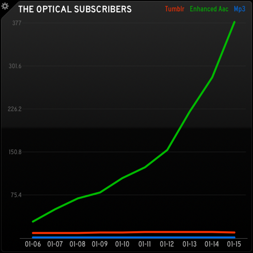

# FeedPress Subscribers Status Board Graph Panel

v1.0 • released 2014-01-19 • [Download on GitHub](https://github.com/bobtiki/FeedPress-Subscribers-Status-Board-Graph-Panel) • [Full Write-up](http://wp.me/p3sLxU-uf)

Made to grab several days of stats from multiple feeds on [FeedPress](http://feedpress.it) and create a JSON file with feed data for a [Panic Status Board](http://panic.com/statusboard/) Graph Panel.

If you only want to see seven days of stats from one feed, [FeedPress already has you covered](http://feedpress.it/support/questions/status-board).

Originally written to graph stats for **The Optical Podcast**. If you like 80's effects movies, and interviews with effects artists, please give it a listen: [http://opticalpodcast.com](http://opticalpodcast.com)

## Requirements

At least one feed hosted on FeedPress.

Written against Python 2.7.5. Not tested against any other versions, but it's pretty simple, so expect it's fairly portable.

This script requires [Requests](http://docs.python-requests.org/en/latest/) for its URL handling, and was written against v2.2.0. If you have `pip`, it's easy to install:

	pip install requests

Don't forget to customize your `API_KEY`, `API_TOKEN`, and `FEEDS` at the top. These are required to access the API and get your data. More information about the FeedPress API, and how to get your tokens, is available at [http://feedpress.it/api](http://feedpress.it/api).

## Customization

Under `FEEDS`, `'name'` is what your feed is called on FeedPress. for example:

	feedpress.me/name

The `'alias'` is what you'd like that feed to be titled in the graph's key. In the example above, that's "Tumblr", "Enhanced AAC" and "MP3".

> Note that the current version of Status Board makes these terms conform to Title Case, so abbreviations like "AAC" and "MP3" look a little weird. Panic's handling of this may change in future versions.

The `'color'` is what color each line will be drawn with on the graph. Color values can be `yellow`, `green`, `red`, `purple`, `blue`, `mediumGray`, `pink`, `aqua`, `orange`, or `lightGray`, according to the Status Board 1.3 [Graph Tutorial](http://www.panic.com/statusboard/docs/graph_tutorial.pdf) documentation.

`GRAPH_TITLE` is the title of the graph, "The Optical Subscribers" in the example above.

`HISTORY_LENGTH` is an integer number of days you'd like to see plotted on the graph.

> **Known issue:** If all of the feeds don't have the same number of days available, the graph gets screwed up. Status Board 1.3 seems to assume all of the graph lines start on the same date, and left-justifies all of the graph lines, so they no longer line up with each other. A quick workaround is just to keep the `HISTORY_LENGTH` to the number of days for which you have data for all feeds.

`DATE_FORMAT` controls the date shown along the X-axis (bottom) of the graph. Use [standard Python date formatters](http://docs.python.org/2/library/datetime.html#strftime-and-strptime-behavior) to customize this.

`FILE_PATH` is the file that you're going to write the JSON data to, which you'll then load up in Status Board.

## Operation

Once you have it customized to fetch your data, the script is run from the command line like any Python script:

	python feedpress_subscribers_panel_json.py

You can make it run on a schedule by adding it to your `cron` jobs, or if you'd like a GUI to set that up with, I recommend [Lingon](https://itunes.apple.com/us/app/lingon-3/id450201424?mt=12&uo=4&at=10lmSY), which lets you easily add scheduled tasks on Mac OS X.

FeedPress (as of this writing) only updates their stats once a day, so there's no sense in scheduling this script to run more often than that. Check your feed's Dashboard page on their site to see the countdown until the next update, to get a sense of what time of day you should schedule your script to run. For instance:

> Next subscribers count update in 11 hours, 26 minutes.

Loading it up in Status Board is pretty simple, but you can see Panic's [Graph Tutorial](http://www.panic.com/statusboard/docs/graph_tutorial.pdf) for more information.

The easiest way (unless you're running a web server) is to write the file to your [Dropbox](https://db.tt/LiFdI5LM) account, which you can also access in the most recent versions of Status board.

## Support

This script is officially **unsupported,** but if you run into any real snags, [say hi on Twitter](http://twitter.com/bobtiki), and I'll see what I can do to help.

-----

&copy; 2014 Mark Boszko  
Released under The MIT License (MIT)  
[http://opensource.org/licenses/MIT](http://opensource.org/licenses/MIT)

Use as you like. Enjoy!